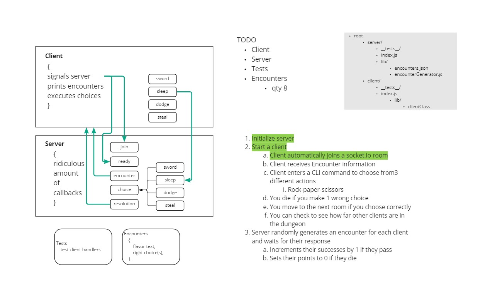

# Dungeon.io

## How To Use:

  - `npm i` to install needed dependencies
  - You'll need to open up two terminals
    - One for src/client/index.js
    - Another for src/server/index.js
  - Run `node index.js` on server first
  - Run `node index.js` on client OR `node index.js start`
      - This will initiate the demo version of the game
  - You will need to run `node index.js` with a choice verb.
  - If your chosen verb matches one in our given list of verbs you'll be awarded a point.
  - If your chosen verb does not match - You die - score resets to zero

### Example:

  ```
    $ node index.js 
    I choose to start
    Adored Giant Tube Worm hosepipes vastly absent your defenseless anniversary
    $ node index.js decapitate
    I choose to decapitate
    Good Choice? You scored 1 points.
    $
  ```



## Initial Intended Requirements:
  - A “hub” server that moderates all events
  - Multiple “clients” that connect to the hub which can both publish and subscribe to events
  - Must operate over a network
  
  - Optional (Future Iteration):

  - Engage an API that uses a database to store/retrieve information based on the events being triggered
  - Employ a standard “Queue” to ensure all messages are properly delivered
  - Employ a FIFO “Queue” to ensure ordered delivery of some events

## Dependencies Used:
  - Server Section
    - @faker-js/faker: ^6.1.2
    - chance: ^1.1.8
    - jest: ^27.5.1
    - socket.io: ^4.4.1
  
  - Client Section
    - commander: ^9.1.0,
    - socket.io-client: ^4.4.1

## Contributors:
  - Rey Mercado
  - Jeffrey Jenkins
  - Chattray Chea